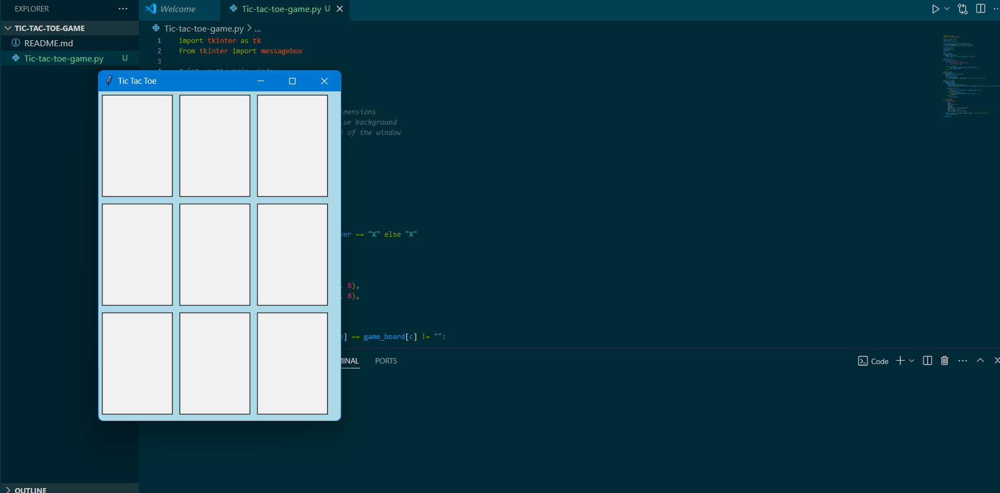
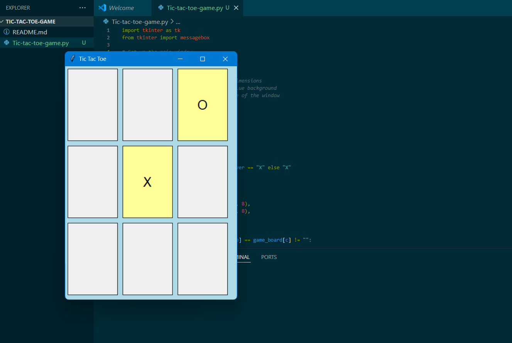
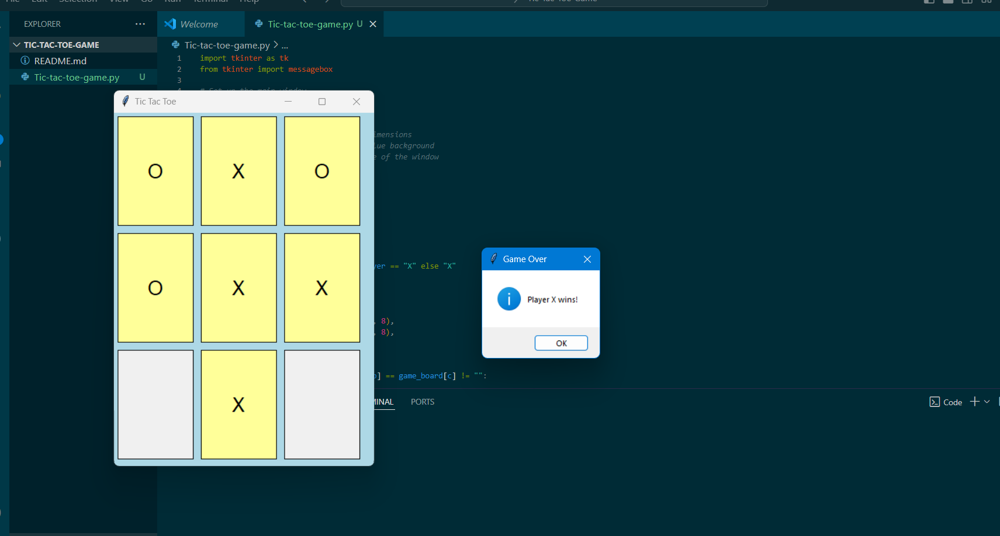
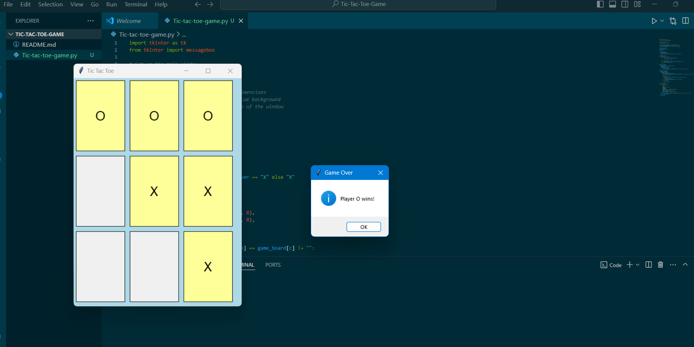
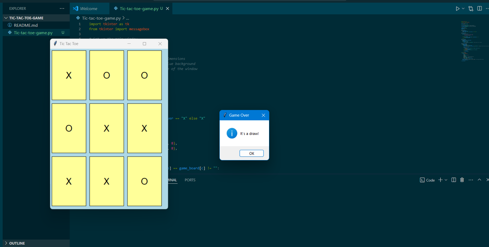

# Tic-Tac-Toe Game using `tkinter`

## Project Description

This is a simple Tic-Tac-Toe game developed using Python's `tkinter` library. It provides a basic implementation of a 3x3 grid game where two players, X and O, take turns to place their symbols on the board. The first player to align three of their symbols in a row, column, or diagonal wins the game.

### Features

- **Two-player mode**: Playable by two players taking turns on the same device.
- **Win and Draw Detection**: Detects and announces a win or a draw.
- **Reset Game**: The board resets after each game.

### Technologies Used

- **Python**: Programming language used to develop the game.
- **tkinter**: GUI toolkit for creating the game interface.

### How to Run

1. Ensure you have Python installed (Python 3.x recommended).
2. Run the following command in the terminal:

   ```bash
   python tic_tac_toe.py

# Screenshots

## GUI 
   
